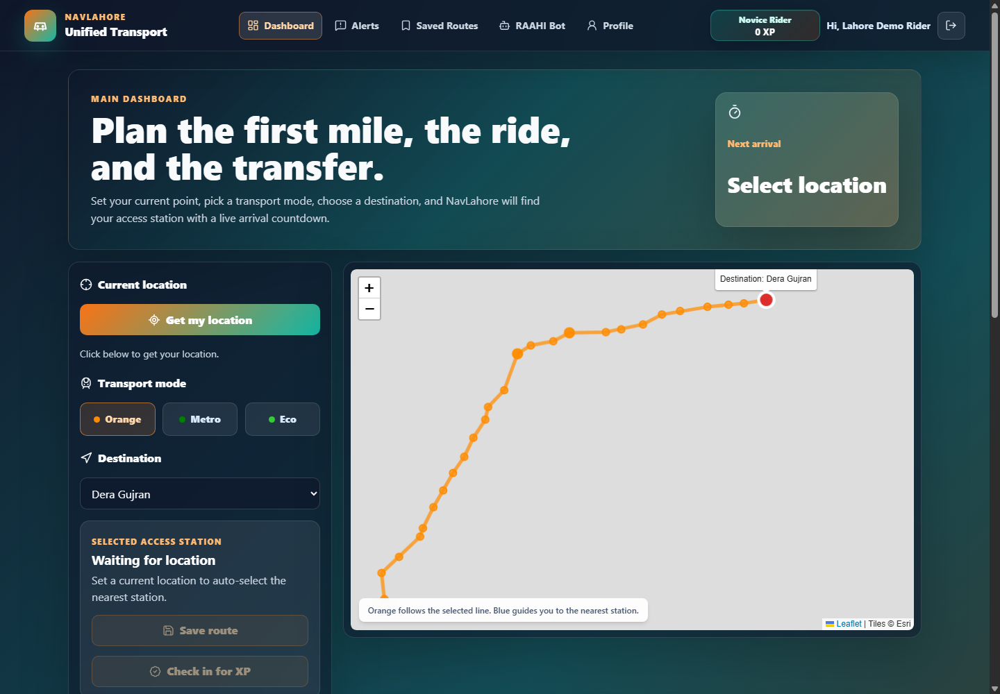
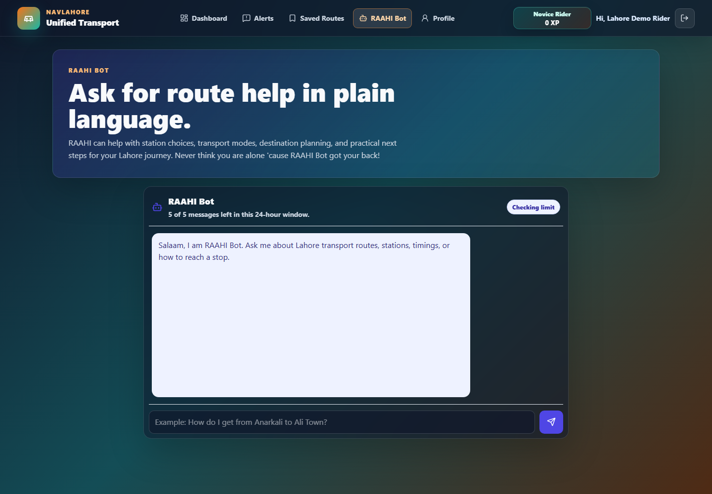
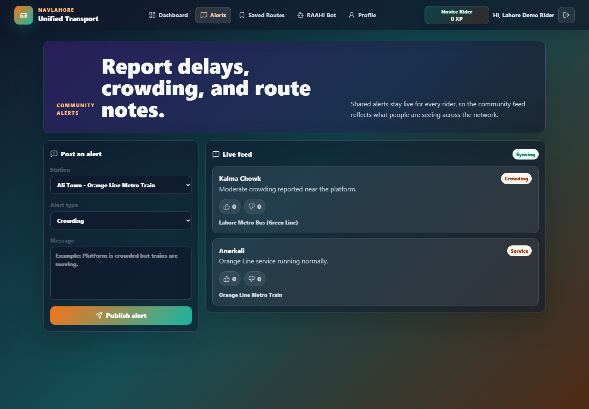

# navLahore

navLahore is a unified public transport web app for Lahore, Pakistan. It helps riders explore Orange Line, Metro Bus, and Speedo feeder routes, compare nearby stations, plan transfers, save routes, report service alerts, and ask transport questions through the RAAHI assistant.

Live app: [lahore-transport-six.vercel.app](https://lahore-transport-six.vercel.app/)

## Features

- Unified route planner for Orange Line Metro Train, Lahore Metro Bus, and Speedo feeder routes.
- Station-aware planning with distances, route suggestions, arrival context, and transfer guidance.
- RAAHI Bot, a Gemini and Pinecone powered transport assistant for fares, routes, schedules, and policy questions.
- Community alerts for delays, crowding, closures, and service updates.
- Firebase Authentication with Google/email login and Firestore-backed rider data.
- Profile, saved routes, rider stats, XP, and achievement badges.
- Offline demo mode for local screenshots and review when Firebase is not configured.

## Screenshots

Place project screenshots in `assets/` with these names:





## Tech Stack

- React 19 and Vite
- Firebase Authentication and Cloud Firestore
- Vercel serverless functions
- Google Gemini for RAAHI responses and embeddings
- Pinecone for transport knowledge retrieval
- Leaflet and React Leaflet for map-based transit views
- Tailwind CSS and custom CSS for the interface


If you use GitHub CLI instead:

```bash
gh repo create nav-lahore --public --source=. --remote=origin --push
```
