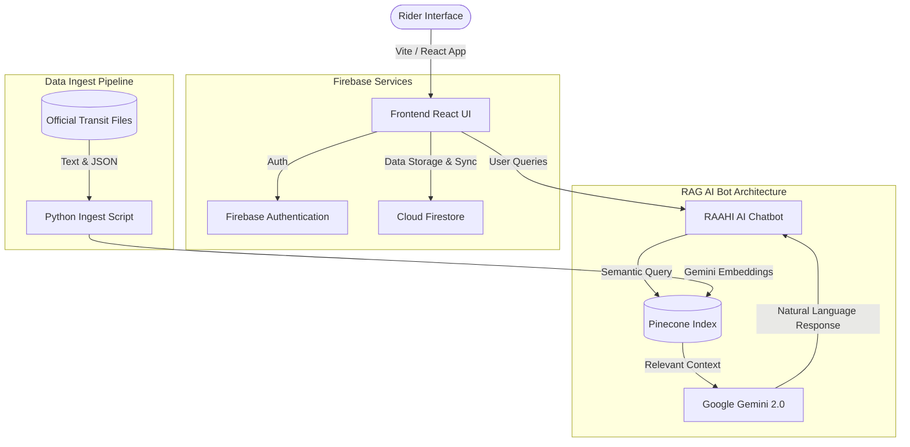

# navLahore: Unified Lahore Transport Navigator & RAG Chatbot

[](https://react.dev/)
[](https://vitejs.dev/)
[](https://firebase.google.com/)
[](https://www.pinecone.io/)
[](https://ai.google.dev/)
[](https://opensource.org/licenses/MIT)

navLahore is a modern, unified public transit navigation app for Lahore, Pakistan. It simplifies urban transit by providing routing, schedule tracking, community-driven service alerts, and an AI-powered assistant (Raahi Bot) to make public transit accessible, reliable, and engaging.

> 🌐 **Live Application**: Access the web app live on Vercel at **[lahore-transport-six.vercel.app](https://lahore-transport-six.vercel.app/)**

---

## 🚀 Key Features

- **🗺️ Unified Transit Planner**: Interactive routing and schedule lookups for Lahore's primary transit networks:
  - **Orange Line Metro Train (OLMT)**
  - **Lahore Metro Bus (Green Line)**
  - **Speedo Feeder Bus Network (Eco-Bus)**
- **🤖 RAAHI AI Chatbot**: A Retrieval-Augmented Generation (RAG) assistant powered by **Gemini** and **Pinecone**. It provides immediate answers about ticketing, fares, connections, schedules, and transit policies based on official transit manuals.
- **📢 Crowd-Sourced Community Alerts**: Real-time traffic, platform crowding, and delay warnings reported and upvoted/verified by fellow riders.
- **🏆 Gamified Rider Rewards**: Earn experience points (XP) and unlock badges (e.g., "Green Commuter", "Station Checker") by checking in at transit hubs and contributing verified status updates.
- **👤 Profile & Saved Routes**: Sync bookmarks, transit statistics, carbon offset footprint, and personalized routes using Firebase.

---

## 📂 Repository Directory Structure

```directory
nav-lahore/
├── README.md                  # Main overview, setup, and monorepo details (This file)
├── .gitignore                 # Excludes packages, system files, and local .env keys
├── assets/                    # Directory for hosting screenshot previews in README
│   └── .gitkeep
├── data-ingestion/            # Python backend for RAG knowledge base setup
│   ├── .env.example           # Configuration template for Pinecone & Gemini keys
│   ├── ingest_rag.py          # Script to chunk, embed, and upload transit documents to Pinecone
│   └── data/                  # Reference JSON and TXT transit data for Orange Line, Metro Bus, and Speedo Bus
└── frontend/                  # React & Vite client application
    ├── src/                   # Components, views, custom hooks, and Firebase configs
    ├── package.json           # Frontend package dependencies
    └── vite.config.js
```

---

## 🛠️ Tech Stack & Architecture



---

## ⚙️ Local Development & Quick Start

### 1. Running the Frontend in "Demo Mode" (Offline)
If you want to view, test, or take screenshots of the dashboard and features locally without configuring a Firebase database:
We have built an **Offline Demo Mode** directly into the login screen!

1. Navigate to the `frontend/` directory:
   ```bash
   cd frontend
   ```
2. Install npm dependencies:
   ```bash
   npm install
   ```
3. Launch the development server:
   ```bash
   npm run dev
   ```
4. Open the local address in your browser (typically `http://localhost:5173`).
5. Since Firebase is not configured, the login screen will automatically show a green **"Enter Demo Mode (Offline)"** button. Click it to immediately bypass login and browse the dashboard, chatbot page, alerts, and profile screens!

---

### 2. Full Firebase Setup (Optional)
To set up active database storage and Google/Email auth:
1. Create a Firebase project in the [Firebase Console](https://console.firebase.google.com/).
2. Enable **Authentication** (Google Sign-In and Email/Password provider) and **Cloud Firestore**.
3. Create a `.env.local` file inside the `frontend/` directory and populate it with your Firebase Web App credentials:
   ```env
   VITE_FIREBASE_API_KEY=your_api_key
   VITE_FIREBASE_AUTH_DOMAIN=your_auth_domain
   VITE_FIREBASE_PROJECT_ID=your_project_id
   VITE_FIREBASE_STORAGE_BUCKET=your_storage_bucket
   VITE_FIREBASE_MESSAGING_SENDER_ID=your_messaging_sender_id
   VITE_FIREBASE_APP_ID=your_app_id
   ```
4. Start the app locally with `npm run dev` to use live syncing!

---

### 3. Data Ingestion for RAAHI Bot (Pinecone & Gemini)
To ingest public transport knowledge base documents into Pinecone for semantic search:
1. Navigate to the `data-ingestion/` directory:
   ```bash
   cd data-ingestion
   ```
2. Install Python dependencies:
   ```bash
   pip install google-genai pinecone-client requests
   ```
3. Copy the `.env.example` file to `.env`:
   ```bash
   copy .env.example .env
   ```
4. Fill in your `PINECONE_API_KEY`, `PINECONE_HOST`, and `GEMINI_API_KEY`.
5. Run the ingestion pipeline script:
   ```bash
   python ingest_rag.py
   ```
   *The script chunks the transit schedules and metadata, embeds them using Gemini, and uploads the vectors to Pinecone.*

---

## 📸 Screenshots & Visual Previews

Run the app in **Demo Mode**, take screenshots of the following pages, and save them in the `assets/` folder to display them here!

### 1. Unified Dashboard & Route Planner

*(Run local dev, take a screenshot of the main planner page, and save it as assets/dashboard_preview.png)*

### 2. RAAHI AI Chatbot

*(Run local dev, take a screenshot of RAAHI Bot page, and save it as assets/chatbot_preview.png)*

### 3. Community Transit Alerts

*(Run local dev, take a screenshot of Community Alerts page, and save it as assets/alerts_preview.png)*
